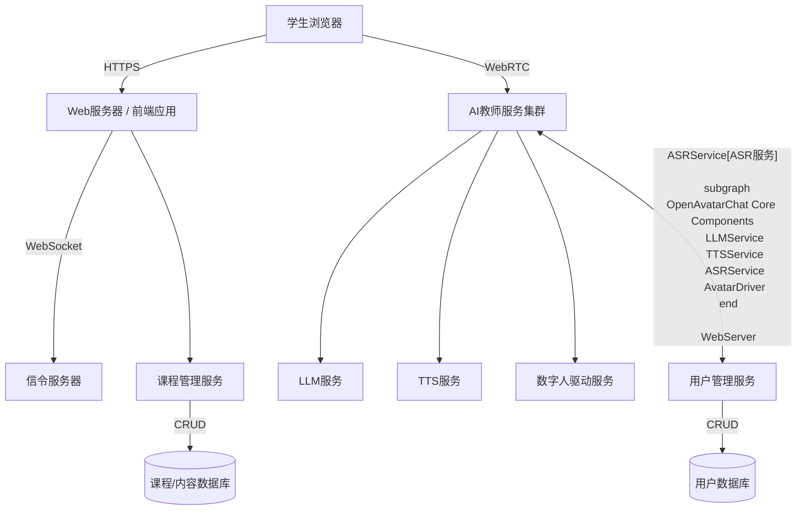

# AI在线教学网站开发计划

## 1. 项目背景与目标

本项目旨在基于现有的OpenAvatarChat项目，扩展开发一个AI在线教学网站。核心目标是利用项目中成熟的数字人技术，结合实时音视频通讯，实现1对1在线教学场景。

## 2. 现有项目能力分析 (OpenAvatarChat)

### 2.1 核心技术栈
- **数字人能力**: 支持多种Avatar实现（LiteAvatar、LAM、MuseTalk）
- **聊天引擎**: 模块化的Handler架构，支持灵活的组件替换
- **RTC服务**: 完整的WebRTC基础设施，包含信令服务和TURN服务
- **AI处理链路**: ASR(SenseVoice) + LLM(OpenAI兼容) + TTS(CosyVoice/EdgeTTS)

### 2.2 现有Handler模块分析
- `src/handlers/client/rtc_client/`: WebRTC客户端处理，支持音视频流传输
- `src/handlers/avatar/`: 三种数字人实现
  - `musetalk/`: 基于视频驱动的数字人，支持自定义形象
  - `liteavatar/`: 轻量级数字人实现
  - `lam/`: 超写实3D数字人（SIGGRAPH 2025）
- `src/handlers/asr/sensevoice/`: 语音识别模块
- `src/handlers/tts/`: 多种TTS实现（CosyVoice、EdgeTTS）
- `src/handlers/llm/openai_compatible/`: 兼容OpenAI API的LLM接口
- `src/service/rtc_service/`: RTC服务基础设施

### 2.3 技术优势
- **低延迟**: 平均响应延迟约2.2秒
- **模块化设计**: Handler架构支持灵活扩展
- **多模态支持**: 文本、音频、视频全覆盖
- **成熟的WebRTC集成**: 已有完整的实时通讯解决方案

## 3. 核心功能规划 (1v1在线教学)

### 3.1 用户角色
- **学生 (Student)**
- **AI教师 (AI Teacher - 数字人)**

### 3.2 主要功能模块

1.  **用户认证与管理**
    *   学生登录/注册
    *   （未来可扩展）教师管理后台
2.  **课程选择/进入**
    *   学生选择教学科目或课程
    *   进入1v1教学房间
3.  **实时视频教学房间**
    *   **学生端**: 
        *   看到AI教师（数字人）的视频画面
        *   听到AI教师的声音
        *   通过麦克风与AI教师语音交流
        *   （可选）通过摄像头让AI教师看到学生（用于表情分析等进阶功能）
        *   （可选）文字聊天辅助
    *   **AI教师端 (数字人)**:
        *   根据教学内容和学生互动，生成相应的语音和数字人表情、动作
        *   接收学生语音，通过ASR转换为文本
        *   LLM处理学生问题和教学逻辑
        *   TTS将LLM答复转换为语音
        *   驱动数字人模型进行表达
    *   **共享白板/屏幕** (V2功能，初期可简化)
4.  **教学内容管理**
    *   预设教学脚本或知识库
    *   LLM与知识库结合，动态生成教学内容
5.  **互动反馈机制**
    *   学生提问与AI教师解答
    *   （未来可扩展）教学评估、学习进度跟踪

## 4. 技术选型与架构设计

### 4.1 前端
-   **Web框架**: React / Vue.js / Svelte (根据团队熟悉度和项目需求选择)
-   **UI库**: Material UI / Ant Design / Tailwind CSS
-   **WebRTC客户端**: 利用浏览器原生API或相关库 (如 `simple-peer`)

### 4.2 后端架构优化
-   **核心框架**: 基于现有FastAPI + Gradio架构
-   **Handler扩展**: 新增教学专用Handler模块
    ```
    src/handlers/teaching/
    ├── course_manager/          # 课程管理Handler
    ├── student_interaction/     # 学生交互Handler  
    ├── teaching_content/        # 教学内容Handler
    └── assessment/              # 评估反馈Handler
    ```
-   **数字人服务**: 复用现有Handler架构
    *   **推荐MuseTalk**: 支持自定义教师形象，表现力强
    *   **ASR**: SenseVoice (已集成)
    *   **LLM**: OpenAI兼容接口 (支持Qwen-VL-Plus等)
    *   **TTS**: CosyVoice (高质量中文语音)
-   **数据库**: PostgreSQL (关系型数据，适合教学场景)
-   **配置管理**: 基于现有YAML配置系统扩展

### 4.3 整体架构 (初步设想)



## 5. 开发阶段与里程碑

### 阶段一: 核心功能验证 (MVP - 2周)
**目标**: 实现最基础的1v1数字人视频教学流程

#### Week 1: 基础框架搭建
**任务**:
1. **环境准备**
   ```bash
   # 创建教学平台分支
   git checkout -b teaching-platform
   
   # 复制并修改配置文件
   cp config/chat_with_openai_compatible_bailian_cosyvoice_musetalk.yaml \
      config/teaching_basic.yaml
   ```

2. **配置文件定制**
   ```yaml
   # config/teaching_basic.yaml
   default:
     service:
       host: "0.0.0.0"
       port: 8283  # 区别于原项目端口
     chat_engine:
       handler_configs:
         # 复用现有handlers
         SenseVoice: { enabled: true }
         CosyVoice: { enabled: true, voice: "longxiaochun" }
         AvatarMusetalk: { enabled: true }
         LLM_Bailian: 
           enabled: true
           system_prompt: "你是一位专业的AI教师，请用简洁易懂的语言进行教学，每次回答控制在2-3句话内。"
         # 新增教学handler（后续实现）
         TeachingManager:
           module: teaching/course_manager/teaching_handler
           default_subject: "数学"
           session_timeout: 1800
   ```

3. **前端界面改造**
   - 基于现有`demo.py`创建`teaching_demo.py`
   - 添加课程选择界面
   - 优化教学场景的UI布局

#### Week 2: 核心功能集成
**任务**:
1. **教学Handler开发**
   - 创建基础的TeachingManager Handler
   - 实现简单的课程管理逻辑
   - 集成现有ASR/TTS/Avatar pipeline

2. **教学场景实现**
   - 实现数学问答教学场景
   - 优化LLM prompt for教学
   - 测试完整的交互流程

3. **性能优化**
   - 调优音视频延迟
   - 优化数字人响应速度

**预期产出**: 可演示的1v1数学教学原型

### 阶段二: 功能完善与体验优化
-   **目标**: 完善用户体验，增加核心教学辅助功能。
-   **任务**:
    1.  实现双向音视频（如果需要AI教师“看到”学生）。
    2.  优化数字人表现力（更丰富的表情和动作）。
    3.  开发用户登录注册模块。
    4.  开发简单的课程选择界面。
    5.  优化语音识别和合成的准确性和流畅度。
    6.  初步的教学内容管理。
-   **预期产出**: 一个功能相对完整的1v1在线教学应用。

### 阶段三: 扩展与部署
-   **目标**: 增加更多高级功能，准备上线部署。
-   **任务**:
    1.  （可选）共享白板/屏幕功能。
    2.  教学效果评估与反馈。
    3.  系统性能优化与压力测试。
    4.  安全加固。
    5.  编写详细的部署文档和用户手册。
-   **预期产出**: 一个可部署的、功能丰富的AI在线教学网站。

## 6. 风险与挑战

-   **技术复杂度**: WebRTC、数字人技术、AI模型集成均有较高技术门槛。
-   **性能要求**: 实时音视频传输和AI处理对服务器性能要求高。
-   **数字人自然度**: 实现自然流畅的数字人交互体验具有挑战。
-   **教学内容设计**: 设计高质量、AI驱动的教学内容需要专业知识。

## 7. 技术实现细节

### 7.1 数据库设计
```sql
-- 用户表
CREATE TABLE users (
    id SERIAL PRIMARY KEY,
    username VARCHAR(50) UNIQUE NOT NULL,
    email VARCHAR(100),
    created_at TIMESTAMP DEFAULT NOW()
);

-- 课程表
CREATE TABLE courses (
    id SERIAL PRIMARY KEY,
    name VARCHAR(100) NOT NULL,
    subject VARCHAR(50) NOT NULL,
    difficulty_level INTEGER DEFAULT 1,
    description TEXT,
    created_at TIMESTAMP DEFAULT NOW()
);

-- 学习会话表
CREATE TABLE learning_sessions (
    id SERIAL PRIMARY KEY,
    user_id INTEGER REFERENCES users(id),
    course_id INTEGER REFERENCES courses(id),
    start_time TIMESTAMP DEFAULT NOW(),
    end_time TIMESTAMP,
    session_data JSONB,  -- 存储交互记录
    status VARCHAR(20) DEFAULT 'active'
);
```

### 7.2 关键技术决策
- **数字人选择**: MuseTalk (支持自定义教师形象，表现力强)
- **LLM**: Qwen-VL-Plus (支持多模态，教学效果好)
- **TTS**: CosyVoice (中文语音质量高)
- **前端**: React + Ant Design (丰富的教育组件)
- **状态管理**: Redux Toolkit (复杂交互状态管理)

## 8. 立即行动计划

### 第一步: 环境准备 (今天)
1. 创建teaching-platform分支
2. 复制并修改配置文件
3. 测试现有系统运行状态

### 第二步: 快速原型 (明天开始)
1. 修改demo.py，添加教学UI
2. 创建基础的课程选择界面
3. 实现简单的数学问答场景

### 第三步: 功能验证 (本周内)
1. 测试完整的教学交互流程
2. 优化延迟和用户体验
3. 准备演示版本

---
*本文档将根据项目进展持续更新。*
*最后更新: 2024年12月 - 添加详细技术实现方案*