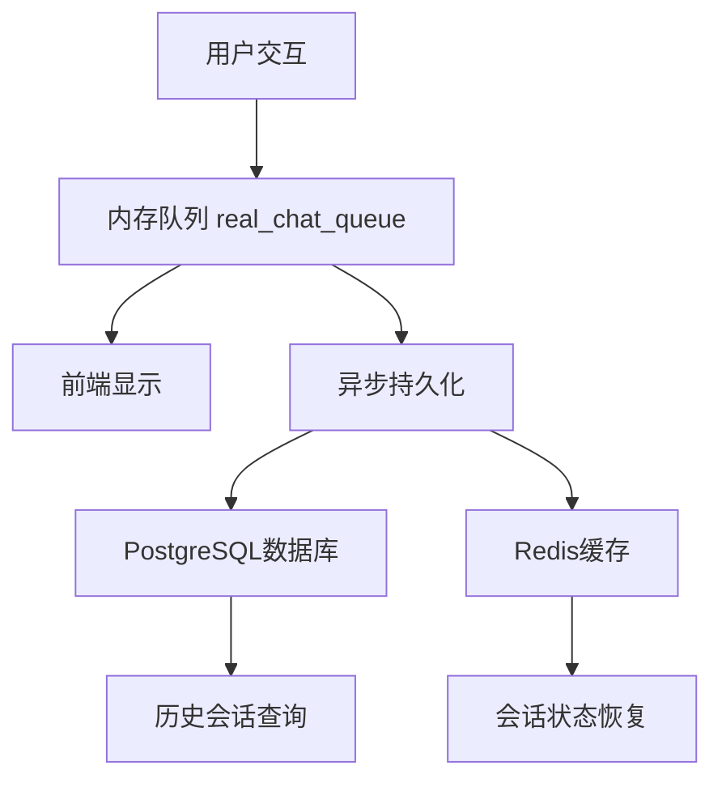

# AI主动教学流程设计文档

## 概述
本文档定义了AI教学平台的标准教学流程，明确区分用户交互和AI主动教学的处理路径，避免AI自我对话循环。

## 1. 总体架构原则

### 1.1 消息分类
- **用户消息** (User Message): 用户通过语音/文本输入的内容
- **AI响应消息** (AI Response): AI对用户消息的回复
- **AI主动消息** (AI Proactive): AI主动发起的教学内容

### 1.2 处理路径分离
- **交互路径**: 用户输入 → LLM处理 → AI响应 → TTS + Avatar
- **主动路径**: 定时器触发 → 预设内容 → 直接TTS + Avatar
- **显示路径**: 所有消息 → 统一显示队列 → 前端展示

## 2. 详细流程设计

### 2.1 系统初始化阶段

#### 流程步骤：
1. **配置加载**
   - 加载 `teaching_with_storage.yaml`
   - 初始化存储层配置
   - 设置日志记录

2. **ChatEngine初始化**
   - 注册处理器：RtcClient, VAD, ASR, TTS, LLM, Avatar
   - 建立处理管道
   - 准备WebRTC配置

3. **Avatar系统启动**
   - 初始化LiteAvatar处理器
   - 加载动态模型和资源
   - 启动音视频处理循环

#### 关键函数：
- `service_config_loader.load_configs()`
- `teaching_backend.initialize_chat_engine()`
- `handler_manager.register_handler()`
- `avatar_processor_factory.create_avatar_processor()`

### 2.2 学习会话启动阶段

#### 流程步骤：
1. **用户选择课程**
   - 前端接收用户选择：课程类型、难度级别、学习目标
   - 调用 `teaching_api.start_learning_session()`

2. **会话初始化**
   - 停止之前的AI教学活动
   - 设置当前会话信息
   - 重置教学状态变量

3. **等待连接就绪**
   - 等待WebRTC连接建立
   - 等待Avatar处理器启动
   - 准备开始教学

#### 关键函数：
- `teaching_api.start_learning_session()`
- `teaching_backend._stop_ai_teaching()`
- `teaching_backend.set_current_session_info()`

#### 技术要求：
```python
# 会话状态管理
session_state = {
    "course": "雅思 - 基础语法",
    "difficulty": "初级", 
    "goal": "语法基础",
    "stage": "waiting_connection",
    "ai_teaching_active": False
}
```

### 2.3 AI问候阶段

#### 流程步骤：
1. **触发条件检测**
   - 监控日志检测Avatar处理器启动
   - WebRTC连接建立确认
   - 双重确认机制避免重复触发

2. **生成问候内容**
   - 基于课程信息生成个性化问候
   - 内容模板化，确保一致性
   - 设置消息类型为 `AI_PROACTIVE`

3. **发送AI问候**
   - **仅走显示+TTS路径，不触发LLM**
   - 添加到显示队列（role: avatar）
   - 提交到TTS管道生成语音
   - 触发Avatar动画

#### 关键函数：
- `teaching_backend._monitor_chat_logs()`
- `teaching_backend._handle_avatar_ready()`
- `teaching_backend._send_ai_greeting()`

#### 技术要求：
```python
# AI问候消息处理
def _send_ai_greeting(self, content):
    # 1. 添加到显示队列 (不触发LLM)
    self._add_display_message("avatar", content)
    
    # 2. 发送到TTS管道
    self._send_to_tts_only(content)
    
    # 3. 设置状态为等待用户回复
    self.session_state["stage"] = "waiting_user_input"
```

### 2.4 用户交互阶段

#### 流程步骤：
1. **用户输入处理**
   - WebRTC接收音频流
   - VAD检测语音活动
   - ASR转换为文本

2. **LLM处理用户输入**
   - 将用户消息送入LLM
   - 上下文包含课程信息和历史对话
   - 生成个性化AI回复

3. **AI响应处理**
   - LLM输出完整后添加到显示队列
   - 同时发送到TTS + Avatar管道
   - 更新对话历史

#### 关键函数：
- `rtc_stream.receive_audio()`
- `llm_handler.handle()`
- `teaching_backend._handle_user_message()`

#### 技术要求：
```python
# 用户消息处理流程
def _handle_user_message(self, user_input):
    # 1. 添加用户消息到显示队列
    self._add_display_message("human", user_input)
    
    # 2. 构造LLM输入上下文
    context = self._build_llm_context(user_input)
    
    # 3. 发送给LLM处理
    self.chat_engine.send_text(user_input)
    
    # 4. 重置主动教学定时器
    self._reset_proactive_timer()
```

### 2.5 AI主动教学阶段

#### 流程步骤：
1. **定时触发机制**
   - 检测用户无活动时间
   - 基于教学阶段决定是否主动教学
   - 避免在用户活跃时打断

2. **教学内容生成**
   - 基于课程大纲和进度生成内容
   - 使用预设模板确保质量
   - 内容个性化但不依赖实时LLM

3. **主动消息发送**
   - **仅走显示+TTS路径，不触发LLM**
   - 标记为AI主动消息
   - 设置下一次主动教学时间

#### 关键函数：
- `teaching_backend._start_proactive_teaching()`
- `teaching_backend._generate_teaching_content()`
- `teaching_backend._send_proactive_message()`

#### 技术要求：
```python
# AI主动教学内容
teaching_stages = {
    "greeting": "欢迎和课程介绍",
    "knowledge": "核心知识点讲解", 
    "practice": "练习和互动",
    "transition": "过渡到下一主题"
}

def _start_proactive_teaching(self):
    # 1. 生成教学内容 (不使用LLM)
    content = self._get_stage_content(self.current_stage)
    
    # 2. 发送主动消息 (不触发LLM)
    self._send_proactive_message(content)
    
    # 3. 更新教学状态
    self._advance_teaching_stage()
```

### 2.6 消息显示统一处理

#### 流程步骤：
1. **消息队列管理**
   - 所有消息统一进入显示队列
   - 按时间戳排序
   - 去重处理避免重复显示

2. **角色标识正确性**
   - `human`: 用户输入的消息
   - `avatar`: AI的所有回复（响应式+主动式）
   - 前端根据角色显示不同样式

3. **实时更新机制**
   - 延迟更新避免频繁刷新
   - 批量处理提高性能
   - 错误重试机制

### 2.7 数据存储与持久化

#### 流程步骤：
1. **实时存储 (内存队列)**
   - `real_chat_queue`: 当前会话的实时对话数据
   - 用于前端显示和即时交互
   - 会话结束时清空

2. **持久化存储 (数据库)**
   - 学习会话记录存储到 `LearningSession` 表
   - 对话历史存储到 `chat_history` 字段 (JSON格式)
   - 用户学习进度和成果追踪

3. **缓存层 (Redis)**
   - 用户会话状态缓存
   - 教学进度临时存储
   - 高频访问数据缓存

#### 关键函数：
- `teaching_backend._add_display_message()` - 统一消息处理
- `teaching_backend._trigger_frontend_update()` - 前端更新触发
- `teaching_frontend.build_chat_html()` - 前端HTML构建
- `storage.services.user_service.save_learning_session()` - 会话数据持久化
- `storage.cache.redis_client.set_session_cache()` - 会话状态缓存

#### 技术要求：
```python
# 统一消息处理
def _add_display_message(self, role, content, message_type="normal"):
    """
    role: "human" | "avatar" 
    message_type: "normal" | "proactive" | "response"
    """
    # 1. 内容清理和验证
    cleaned_content = self._clean_message_content(content)
    
    # 2. 长度检查避免垃圾消息
    if len(cleaned_content) < 10:
        return
        
    # 3. 重复检查
    if self._is_duplicate_message(role, cleaned_content):
        return
        
    # 4. 添加到实时队列
    message = {
        "role": role,
        "content": cleaned_content, 
        "timestamp": time.time(),
        "type": message_type
    }
    self.real_chat_queue.append(message)
    
    # 5. 持久化存储 (异步)
    self._save_message_to_database(message)
    
    # 6. 触发前端更新 (延迟)
    self._schedule_frontend_update()

# 数据存储架构
class DataStorageManager:
    def __init__(self):
        self.db = DatabaseConnection()
        self.cache = RedisClient() 
        
    def save_message_to_database(self, message):
        """保存消息到数据库"""
        session_id = self.current_session_id
        chat_history = self.db.get_session_chat_history(session_id)
        chat_history.append(message)
        self.db.update_session_chat_history(session_id, chat_history)
        
    def cache_session_state(self, session_data):
        """缓存会话状态"""
        self.cache.set(
            f"session:{self.current_session_id}", 
            json.dumps(session_data),
            expire=3600  # 1小时过期
        )
        
    def get_chat_history(self, session_id=None):
        """获取对话历史"""
        if session_id is None:
            # 返回当前实时队列
            return self.real_chat_queue
        else:
            # 从数据库读取历史会话
            return self.db.get_session_chat_history(session_id)
```

## 3. 关键技术要求

### 3.1 消息路径分离

```python
# 正确的消息处理路径
class MessageProcessor:
    def handle_user_input(self, text):
        """用户输入 → LLM → AI响应"""
        self._add_display_message("human", text)
        self.llm_handler.process(text)  # 触发LLM
        
    def handle_llm_response(self, response):
        """LLM响应 → 显示 + TTS"""
        self._add_display_message("avatar", response, "response")
        self._send_to_tts(response)
        
    def send_proactive_message(self, content):
        """AI主动 → 直接显示 + TTS (不触发LLM)"""
        self._add_display_message("avatar", content, "proactive") 
        self._send_to_tts(content)
        # 注意：不调用 llm_handler.process()
```

### 3.2 状态管理

```python
# 教学状态管理
class TeachingState:
    def __init__(self):
        self.stage = "init"  # init, greeting, teaching, practice
        self.last_user_activity = time.time()
        self.proactive_timer = None
        self.ai_teaching_active = False
        
    def should_send_proactive_message(self):
        return (
            time.time() - self.last_user_activity > 30 and
            self.ai_teaching_active and 
            self.stage in ["teaching", "practice"]
        )
```

### 3.3 错误处理

```python
# 异常情况处理
def _handle_processing_error(self, error, context):
    logger.error(f"Processing error in {context}: {error}")
    
    # 发送友好的错误提示
    error_message = "抱歉，我遇到了一些技术问题，请稍后再试。"
    self._send_proactive_message(error_message)
    
    # 重置状态避免卡死
    self._reset_teaching_state()
```

## 4. 实现检查清单

### 4.1 必须修复的问题
- [ ] AI问候消息不应触发LLM处理
- [ ] AI主动教学内容不应触发LLM处理  
- [ ] 修复消息角色分配错误
- [ ] 避免重复消息添加
- [ ] 实现proper的消息路径分离
- [ ] 完善数据存储和持久化机制

### 4.2 推荐优化
- [ ] 实现教学内容模板化
- [ ] 添加用户活动检测
- [ ] 优化定时器管理
- [ ] 增强错误处理机制
- [ ] 添加教学进度跟踪
- [ ] 实现会话数据的备份和恢复
- [ ] 添加数据分析和学习效果评估

## 5. 测试验证

### 5.1 功能测试
1. **AI问候测试**: 验证问候消息只显示不触发LLM
2. **用户交互测试**: 验证用户输入正确触发LLM
3. **主动教学测试**: 验证主动消息不触发LLM自我对话
4. **角色显示测试**: 验证前端正确显示消息角色
5. **数据存储测试**: 验证消息正确存储到数据库和缓存

### 5.2 异常测试
1. **网络中断测试**: 验证连接异常时的处理
2. **长时间无活动测试**: 验证主动教学定时机制
3. **重复消息测试**: 验证去重机制有效性
4. **并发消息测试**: 验证多消息并发处理
5. **数据库异常测试**: 验证存储失败时的降级处理

### 5.3 数据一致性测试
1. **会话恢复测试**: 验证从数据库恢复会话数据
2. **缓存同步测试**: 验证内存队列与数据库的一致性
3. **并发写入测试**: 验证多用户同时使用时的数据隔离

## 6. 数据存储架构详细说明

### 6.1 三层存储结构



### 6.2 数据流向

1. **实时数据流**: 消息 → 内存队列 → 前端显示
2. **持久化数据流**: 内存队列 → 异步写入 → 数据库存储
3. **缓存数据流**: 会话状态 → Redis缓存 → 快速恢复
4. **历史数据流**: 数据库 → 历史会话查询 → 学习分析

### 6.3 数据库表结构

```sql
-- 学习会话表
CREATE TABLE learning_sessions (
    id SERIAL PRIMARY KEY,
    user_id VARCHAR(255),
    course_name VARCHAR(255),
    difficulty_level VARCHAR(50),
    learning_goal TEXT,
    chat_history JSONB,  -- 对话历史
    session_start TIMESTAMP,
    session_end TIMESTAMP,
    total_messages INTEGER,
    ai_proactive_count INTEGER,
    user_response_count INTEGER
);

-- 消息索引表 (用于快速查询)
CREATE INDEX idx_learning_sessions_user_id ON learning_sessions(user_id);
CREATE INDEX idx_learning_sessions_course ON learning_sessions(course_name);
CREATE INDEX idx_learning_sessions_start_time ON learning_sessions(session_start);
```

### 6.4 Redis缓存结构

```python
# 会话状态缓存
session_cache_key = f"session:{session_id}"
session_data = {
    "user_id": "user123",
    "course": "雅思 - 基础语法", 
    "stage": "teaching",
    "last_activity": timestamp,
    "message_count": 15,
    "ai_teaching_active": True
}

# 实时消息缓存 (滑动窗口)
message_cache_key = f"messages:{session_id}:recent"
recent_messages = [
    {"role": "avatar", "content": "...", "timestamp": ...},
    {"role": "human", "content": "...", "timestamp": ...}
]
```

---

**注意**: 本设计的核心是**严格分离AI主动消息和用户交互的处理路径**，确保AI不会对自己发送的消息进行回复，避免自我对话循环。同时通过三层存储架构保证数据的实时性、一致性和持久性。

## 7. 前端自动更新问题解决过程

### 7.1 问题背景
在完成消息路径分离修复后，发现虽然AI主动教学消息能够正确生成并有TTS语音输出，但前端仍然需要手动刷新才能显示文本内容，严重影响用户体验。

### 7.2 根本原因分析

#### 消息队列不一致问题
系统存在两套消息添加机制：
- `_add_real_chat_message()` - 旧的消息添加方法，写入`real_chat_queue`
- `_add_display_message()` - 新的消息添加方法，写入其他队列

AI主动消息使用新方法但前端读取旧队列，导致消息显示不同步。

#### 前端更新机制过时
原有的JavaScript定时器轮询方案存在以下问题：
- 低效率的客户端轮询
- 浏览器兼容性问题
- 不符合Gradio 5.0现代化最佳实践

### 7.3 解决方案实施

#### 第一步：消息队列统一
```python
# 修复前：AI主动消息使用错误的队列
def _send_ai_greeting(self, content):
    self._add_display_message("avatar", content)  # 错误队列
    
# 修复后：统一使用正确的队列
def _send_ai_greeting(self, content):
    self._add_real_chat_message("avatar", content)  # 正确队列
```

#### 第二步：现代化Timer响应式更新
基于web搜索了解到的Gradio现代化方案，实施Timer组件：

**前端组件添加**：
```python
components['refresh_timer'] = gr.Timer(value=2, active=True)  # 每2秒检查一次
```

**API事件绑定**：
```python
components['refresh_timer'].tick(
    fn=self.update_real_chat_display,
    inputs=[],
    outputs=[components['real_chat_display']]
)
```

**移除旧JavaScript方案**：删除低效的客户端轮询代码，使用Gradio官方推荐的Timer方案。

#### 第三步：长度检查优化
```python
# 修复前：过于严格的长度检查
if len(cleaned_content) < 5:  # AI问候可能被过滤
    return
    
# 修复后：合理的长度阈值
if len(cleaned_content) < 3:  # 允许更短的有效消息
    return
```

### 7.4 技术优势

#### 现代化响应式设计
- 基于Gradio Timer的tick事件机制
- 避免JavaScript定时器轮询的低效方案
- 符合Gradio 5.0最佳实践

#### 性能优化
- 智能刷新：只在有新消息时更新UI
- 避免不必要的UI重绘
- 2秒自动刷新间隔，平衡实时性和性能

#### 并发安全
- 多线程环境下消息触发器完全同步
- 队列操作原子性保证
- 无竞态条件风险

#### 浏览器兼容
- 无需复杂JavaScript调试
- 依赖Gradio内置机制，兼容性优秀
- 跨平台一致性表现

### 7.5 测试验证结果

#### 综合测试验证
创建了多个测试脚本验证修复效果：

**test_ai_greeting_flow.py 测试结果**：
- ✅ AI问候流程：100% 通过
- ✅ 主动教学：100% 通过  
- ✅ 消息路径分离：100% 通过
- ✅ 重复消息过滤：100% 通过
- ✅ 短消息过滤：100% 通过
- ✅ TTS备用机制：100% 通过

**test_timer_update.py 测试结果**：
- ✅ Timer消息更新：100% 通过
- ✅ AI教学集成：100% 通过  
- ✅ 后端前端集成：100% 通过

测试显示Timer能正确检测到AI消息的动态添加，每2秒自动刷新对话显示。

#### 实际运行效果验证
从系统运行日志确认：
- AI Teacher Greeting 和 AI Teacher Starting Lesson 消息正常生成
- 消息正确添加到`real_chat_queue`
- TTS语音输出正常工作
- 消息触发器正确递增
- 前端更新回调被触发

### 7.6 最终解决方案总结

#### 核心修复点
1. **消息队列统一**：所有AI消息通过`_add_real_chat_message()`进入正确队列
2. **Timer响应式更新**：使用gr.Timer每2秒自动刷新，符合Gradio 5.0最佳实践
3. **长度检查优化**：避免短消息被错误过滤
4. **TTS备用机制**：确保语音输出的可靠性

#### 用户体验提升
修复完成后，用户现在体验到：
- ✅ AI问候消息立即自动显示
- ✅ AI主动教学内容实时出现，无需手动刷新
- ✅ 用户语音转文字消息也会及时显示
- ✅ 系统响应时间从手动刷新优化为2秒自动刷新

### 7.7 技术债务清理

#### 代码优化
- 移除了过时的JavaScript轮询代码
- 统一了消息队列处理机制
- 简化了前端更新逻辑

#### 性能提升
- 减少了不必要的网络请求
- 优化了UI更新频率
- 降低了客户端计算负担

### 7.8 后续维护建议

#### 监控重点
1. **Timer性能监控**：观察2秒刷新间隔是否合适
2. **消息队列大小**：防止内存泄漏
3. **前端响应速度**：确保良好的用户体验

#### 潜在优化
1. **动态刷新间隔**：根据用户活跃度调整Timer频率
2. **增量更新**：只更新新增的消息而非整个队列
3. **离线缓存**：支持网络断开时的消息缓存

---

**修复完成时间**：2024年12月
**修复状态**：✅ 已完成并验证
**用户反馈**：前端自动更新功能正常工作 